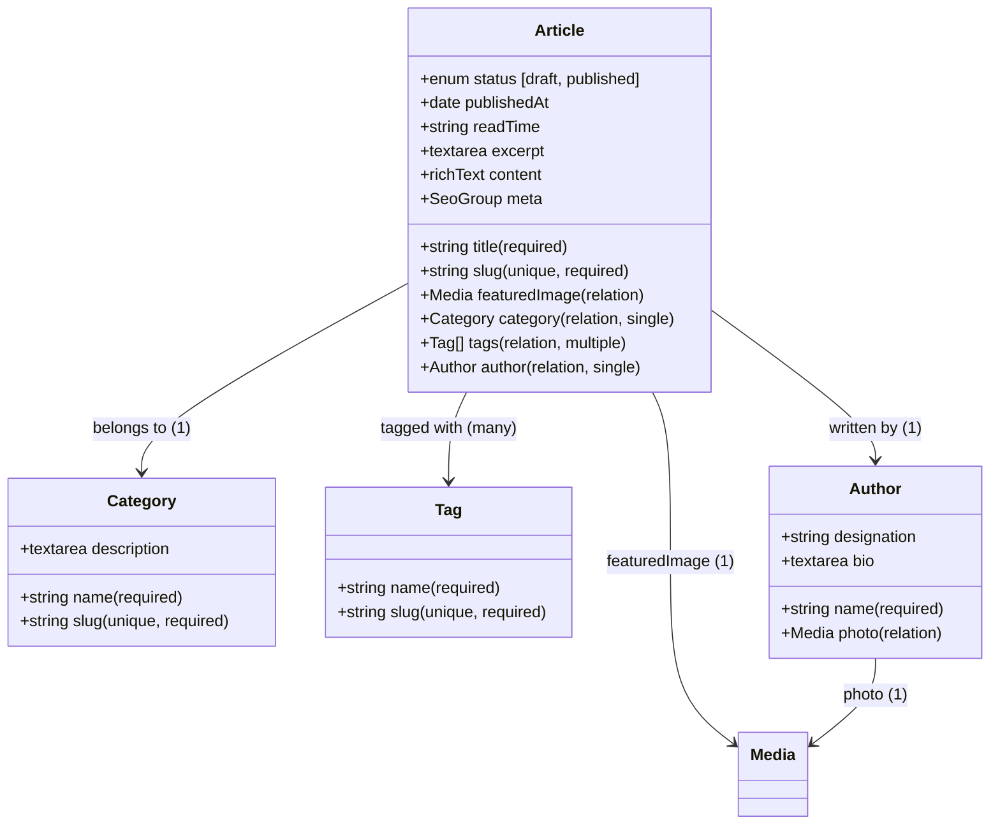

# CMS Module: Articles / Blog

Specification document for the **Articles / Blog** publishing module on the Sekolah Pemikiran Islam (SPI) CMS.

---

## 1. Goals

1. **Structured Content Management**: Provide SPI editors with a rich, user-friendly publishing workflow for Islamic thought articles (*kajian pemikiran Islam*), curriculum essays, institutional news, and alumni stories.
2. **Dynamic Routing & SEO**: Support clean, SEO-friendly dynamic routes (e.g. `/blog/[slug]`), customizable meta titles, descriptions, Open Graph preview images, and automated sitemap inclusion.
3. **Rich Text Formatting**: Empower writers to compose long-form essays with structured headings, blockquotes, callout boxes, lists, and inline media embeds via the Lexical editor without requiring HTML/code knowledge.
4. **Scholarly Author Attribution**: Decouple author profiles from CMS login credentials, allowing articles to be credited to specific teachers, guest scholars, or "Redaksi SPI" with their photo, academic credentials, and biography.
5. **Taxonomy & Discovery**: Enable readers to browse articles by primary category (e.g. *Pemikiran Islam*, *Filosofi Dasar*, *Kurikulum*, *Berita*, *Kisah Alumni*) and filter by cross-cutting conceptual tags (e.g. *Adab*, *Al-Attas*, *Tradisi Ilmu*, *Ghazwul Fikri*).

---

## 2. User Stories

### US-1: Editorial Drafting and Publishing
- **As an** SPI Content Editor,
- **I want to** draft long-form essays using a rich text editor, set publication dates, and manage draft vs. published statuses,
- **So that** articles can be reviewed, scheduled, and published accurately according to our editorial calendar.

### US-2: Primary Topic Categorization
- **As an** Editor,
- **I want to** assign each article to a single primary category,
- **So that** the website has a clear, unambiguous breadcrumb structure and readers can filter archives by main subject matter.

### US-3: Multi-Topic Concept Tagging
- **As an** Editor,
- **I want to** attach multiple tags to an article representing key intellectual concepts,
- **So that** readers can discover related articles discussing similar philosophical or Islamic worldview concepts.

### US-4: Author Credentials Verification
- **As a** Reader,
- **I want to** view the author's credential card (name, photo, academic background, and organizational role) alongside and at the bottom of the article,
- **So that** I can verify the scholarly authority of the arguments presented.

### US-5: Public Archive & Article Reading
- **As a** Website Visitor,
- **I want to** browse a responsive 3-column article listing with thumbnail previews, read time indicators, and publication dates, and navigate to a dedicated reading view with related articles suggestions,
- **So that** I can easily discover and consume SPI's intellectual publications.

---

## 3. Schema Data & Collection Architecture

The module consists of **4 collections** connected via relationships:



---

## 4. Collection Specifications

### 4.1. `Articles` (`slug: "articles"`)
Primary publishing collection for essays, news, and publications.

| Field Name | Type | Required | Default Value | Description |
| :--- | :--- | :---: | :--- | :--- |
| `title` | `text` | Yes | - | Main article headline. |
| `slug` | `text` | Yes | - | URL-friendly identifier (unique, indexed, auto-slugified from title). |
| `status` | `select` | Yes | `draft` | Options: `draft`, `published`. |
| `publishedAt` | `date` | No | - | Publication timestamp. Defaults to current time when published. |
| `readTime` | `text` | No | - | Estimated reading duration (e.g. `8 menit baca`). |
| `featuredImage` | `upload` (`media`) | Yes | - | Primary hero image and thumbnail for listing cards. |
| `excerpt` | `textarea` | No | - | 1-2 sentence summary used for card previews and meta description. |
| `content` | `richText` (Lexical) | Yes | - | Full body text supporting headings, blockquotes, lists, links, and inline images. |
| `category` | `relationship` (`categories`) | Yes | - | Single primary category (`hasMany: false`). |
| `tags` | `relationship` (`tags`) | No | - | Multiple concept tags (`hasMany: true`). |
| `author` | `relationship` (`authors`) | Yes | - | Author attribution (`hasMany: false`). |
| `meta` | `group` | No | - | SEO overrides: `title` (text), `description` (textarea), `image` (upload `media`). |

### 4.2. `Categories` (`slug: "categories"`)
Hierarchical topics for organizing the article archive.

| Field Name | Type | Required | Description |
| :--- | :--- | :---: | :--- |
| `name` | `text` | Yes | Category display name (e.g., *Pemikiran Islam*, *Filosofi Dasar*, *Berita*). |
| `slug` | `text` | Yes | URL-friendly identifier (unique, indexed). |
| `description` | `textarea` | No | Short editorial description of the category scope. |

### 4.3. `Tags` (`slug: "tags"`)
Non-hierarchical conceptual keywords for cross-cutting discovery.

| Field Name | Type | Required | Description |
| :--- | :--- | :---: | :--- |
| `name` | `text` | Yes | Tag label (e.g., *Adab*, *Al-Attas*, *Tradisi Ilmu*, *Ghazwul Fikri*). |
| `slug` | `text` | Yes | URL-friendly identifier (unique, indexed). |

### 4.4. `Authors` (`slug: "authors"`)
Public author profiles decoupled from system administrative accounts.

| Field Name | Type | Required | Description |
| :--- | :--- | :---: | :--- |
| `name` | `text` | Yes | Full name and titles (e.g., *Dr. Akmal Sjafril, S.T., M.Pd.I.*). |
| `designation` | `text` | No | Role or academic title (e.g., *Pendiri dan Kepala Pusat SPI*). |
| `photo` | `upload` (`media`) | No | Author profile photo. |
| `bio` | `textarea` | No | Biographical summary highlighting scholarly background. |

---

## 5. Database Architecture (Table Footprint)

In SQLite and PostgreSQL (managed via Drizzle ORM), this module introduces **5 tables**:

```
Database Schema Footprint:
├── articles                  Main article records, foreign keys to category, author, featuredImage
├── articles_rels             Junction table handling many-to-many relationship with tags
├── categories                Primary topic categories
├── tags                      Concept keywords
└── authors                   Public author profiles
```

- **Single Relations**: `category_id`, `author_id`, and `featured_image_id` are stored directly as foreign key columns inside `articles`, requiring no separate join tables.
- **Many-to-Many Tags**: Handled through the standard Payload relationship table `articles_rels`.
- **Comments**: Formally deferred to a future phase to keep database complexity lean.

---

## 6. Access Control

| Action | `Articles` | `Categories` | `Tags` | `Authors` |
| :--- | :--- | :--- | :--- | :--- |
| **Read** | Public (Published only for visitors; Drafts visible to logged-in users) | Public | Public | Public |
| **Create** | Authenticated Users | Authenticated Users | Authenticated Users | Authenticated Users |
| **Update** | Authenticated Users | Authenticated Users | Authenticated Users | Authenticated Users |
| **Delete** | Authenticated Users | Authenticated Users | Authenticated Users | Authenticated Users |

---

## 7. Frontend Integration Pattern (Next.js)

1. **Archive Listing (`/blog-three-column`)**:
   - Queries `articles` where `status = 'published'`, sorted by `publishedAt DESC`.
   - Populates `category`, `author`, and `featuredImage` (depth: 1).
   - Category and tag filtering via query params (`?category=pemikiran-islam`).
2. **Individual Article Page (`/blog/[slug]` or `/blog-details-standard`)**:
   - Dynamic route fetching article by unique `slug`.
   - Renders Lexical rich text body with custom block styling matching SPI typography.
   - Author card rendered dynamically using populated `author` fields.
   - Related articles query: fetches 3 published articles sharing the same `category`.
3. **Graceful Static Fallback**:
   - Existing mock data in `content/inner/blog-three-column.ts` remains as a secondary fallback if the CMS collection is empty during initial deployment.

---

## 8. Definition of Done (DoD)

- [x] **Specification**: Requirements, schema, access rules, and DoD documented in `docs/articles-blog.md`.
- [ ] **Collections Implementation**:
  - `payload/collections/Articles.ts`
  - `payload/collections/Categories.ts`
  - `payload/collections/Tags.ts`
  - `payload/collections/Authors.ts`
- [ ] **Config Registration**: All 4 collections registered in `payload.config.ts`.
- [ ] **Admin Panel UI Verification**:
  - Editors can create Categories, Tags, and Authors.
  - Editors can compose articles with Lexical rich text, select single category, pick tags, and assign author.
  - Draft vs. Published status transitions function properly.
- [ ] **Database Verification**: Exactly 5 new tables (`articles`, `articles_rels`, `categories`, `tags`, `authors`) created in SQLite.
- [ ] **REST API Verification**: `GET /api/articles` returns published items with populated relations.
- [ ] **Frontend Query Helper**: Helper functions in `lib/getArticles.ts` created for listing and single-article lookup.
- [ ] **Build & Typecheck**: `npx tsc --noEmit` and `npm run build` pass with 0 errors.
