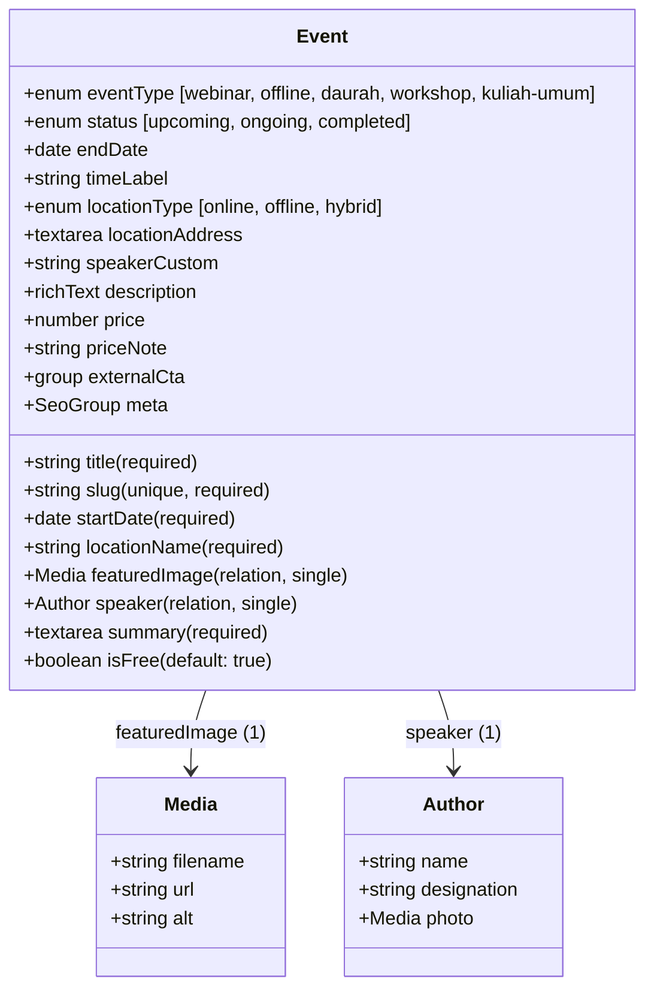

# CMS Module: Events (Webinars, Offline Events, Daurah, Workshops)

Specification document for the **Events** publishing module on the Sekolah Pemikiran Islam (SPI) CMS.

---

## 1. Goals

1. **Centralized Event Announcements**: Provide SPI event organizers and administrators with an intuitive CMS interface to publish and manage announcements for webinars, daurah, seminars, book discussions, and offline events.
2. **Phase 1 Information-Only Architecture**: Focus purely on informational distribution (schedules, speaker lineups, rundown, venue/platform, poster flyers, and external intake URLs) without requiring internal ticketing, payment processing, or user registration infrastructure.
3. **Event Lifecycle Visibility**: Clearly delineate between **upcoming events** (*Akan Datang*), **ongoing activities** (*Sedang Berlangsung*), and **archived records** (*Telah Selesai*) with automated date-based badge indicators and countdown widgets.
4. **Scholarly Speaker Attribution**: Connect events directly to SPI's accredited `authors` collection while also supporting custom guest scholar attributions.
5. **SEO & Social Sharing**: Generate search-engine friendly dynamic routes (`/events/[slug]`) with Open Graph meta cards for broadcast sharing on WhatsApp, Telegram, Instagram, and Twitter/X.

---

## 2. User Stories

### US-1: Event Announcement Publishing
- **As an** SPI Event Coordinator,
- **I want to** draft and publish upcoming event notices with start dates, times, venues, and promotional flyers,
- **So that** prospective attendees can review comprehensive event details in one official place.

### US-2: Flexible Event Format Configuration
- **As an** Event Organizer,
- **I want to** categorize events by format (*Webinar*, *Offline*, *Daurah*, *Workshop*, *Kuliah Umum*) and specify location types (*Online*, *Offline*, *Hybrid*),
- **So that** students immediately know whether they can attend remotely via Zoom or need to travel to a physical venue.

### US-3: Speaker and Faculty Credit
- **As a** Participant,
- **I want to** see who will be speaking or presenting at each event,
- **So that** I can assess the relevance and academic authority of the topic.

### US-4: External Registration / Intake Handoff
- **As an** Event Coordinator,
- **I want to** set an external action button (e.g. Google Forms link, WhatsApp contact, or Zoom registration link) and an intake fee indicator (*Gratis*, *Infaq Terbaik*, or nominal),
- **So that** participants can proceed to our existing intake channels smoothly.

### US-5: Public Event Discovery & Archive
- **As a** Website Visitor,
- **I want to** view a clean listing of all upcoming events with date badges and a toggle to review past events,
- **So that** I never miss an SPI program and can explore topics previously discussed.

---

## 3. Schema Architecture & Entity Relationships

The module operates on a **single primary collection** linked to existing collections:



---

## 4. Collection Specifications

### `Events` (`slug: "events"`)
Publishing collection for academic and public events.

| Field Name | Type | Required | Default Value | Description |
| :--- | :--- | :---: | :--- | :--- |
| `title` | `text` | **Yes** | — | Full event title (e.g. *"Daurah Pemikiran Islam: Meneguhkan Epistemologi Tauhid"*). |
| `slug` | `text` | **Yes** | auto-slug | URL slug (e.g. `daurah-pemikiran-islam-2026`). Unique, indexed. |
| `eventType` | `select` | **Yes** | `"webinar"` | Select: `webinar`, `offline`, `daurah`, `workshop`, `kuliah-umum`. |
| `status` | `select` | **Yes** | `"upcoming"` | Select: `upcoming` (*Akan Datang*), `ongoing` (*Sedang Berlangsung*), `completed` (*Selesai*). |
| `startDate` | `date` | **Yes** | — | Date and start time of the event (ISO date-time picker). |
| `endDate` | `date` | No | — | Optional end date (for multi-day daurah / weekend workshops). |
| `timeLabel` | `text` | No | `"09:00 - 12:00 WIB"` | Human-readable schedule string. |
| `locationType` | `select` | **Yes** | `"online"` | Select: `online`, `offline`, `hybrid`. |
| `locationName` | `text` | **Yes** | — | Primary platform or venue name (e.g. *"Zoom Meeting"* or *"Aula Masjid Raya Bintaro Jaya"*). |
| `locationAddress`| `textarea`| No | — | Physical street address or location guide (displayed for offline/hybrid events). |
| `featuredImage` | `upload` | No | — | Relation to `media`. Promotional poster or banner flyer. |
| `speaker` | `relationship` | No | — | Single relation to `authors` (`hasMany: false`). Scalar foreign key to existing faculty. |
| `speakerCustom` | `text` | No | — | Text override for guest scholars not registered in the `authors` collection. |
| `summary` | `textarea` | **Yes** | — | Short overview for cards, RSS, and social preview cards. |
| `description` | `richText` | No | — | Comprehensive event details, rundown/schedule, and prerequisites using Lexical. |
| `isFree` | `checkbox` | No | `true` | When checked, event is marked as Free (*Gratis*). Defaults to `true`. |
| `price` | `number` | No | `0` | Admission fee / infaq amount in IDR (shown when `isFree` is unchecked). |
| `priceNote` | `text` | No | — | Price notes or inclusions (e.g. *"Termasuk konsumsi, sertifikat, & modul"* or *"Early bird"*). |
| `externalCta` | `group` | No | — | External intake handoff: |
| ↳ `label` | `text` | No | `"Daftar Sekarang"` | Call-to-action button label. |
| ↳ `url` | `text` | No | `"#"` | External registration or meeting link (Google Forms, WhatsApp, Zoom). |
| `meta` | `group` | No | — | SEO overrides: `title`, `description`, `image`. |

---

## 5. Database Schema & SQLite Table Footprint

To satisfy the single-table architectural requirement:
* **Exactly 1 new table**: `events` in `data/payload.db`.
* **Zero auxiliary join tables**:
  - `eventType`, `status`, and `locationType` are standard SQL `varchar` columns.
  - `featuredImage` is a scalar foreign key column `featured_image_id` pointing to `media(id)`.
  - `speaker` is a scalar foreign key column `speaker_id` pointing to `authors(id)`.
  - `description` Lexical rich text is stored as a JSON column in SQLite.
  - `isFree`, `price`, and `priceNote` are direct scalar columns in the `events` table.

```sql
CREATE TABLE `events` (
  `id` integer PRIMARY KEY AUTOINCREMENT NOT NULL,
  `title` text NOT NULL,
  `slug` text NOT NULL UNIQUE,
  `event_type` text NOT NULL DEFAULT 'webinar',
  `status` text NOT NULL DEFAULT 'upcoming',
  `start_date` text NOT NULL,
  `end_date` text,
  `time_label` text,
  `location_type` text NOT NULL DEFAULT 'online',
  `location_name` text NOT NULL,
  `location_address` text,
  `featured_image_id` integer REFERENCES `media`(`id`),
  `speaker_id` integer REFERENCES `authors`(`id`),
  `speaker_custom` text,
  `summary` text NOT NULL,
  `description` text,
  `is_free` integer DEFAULT 1,
  `price` numeric DEFAULT 0,
  `price_note` text,
  `external_cta_label` text,
  `external_cta_url` text,
  `meta_title` text,
  `meta_description` text,
  `updated_at` text NOT NULL,
  `created_at` text NOT NULL
);
```

---

## 6. Frontend Mapping & Integration

| Website Route | Component / File | Purpose |
| :--- | :--- | :--- |
| `/events` | `app/(site)/events/page.tsx` | Event catalog archive listing upcoming and past events with date badges, format chips, and filters. |
| `/events/[slug]` | `app/(site)/events/[slug]/page.tsx` | Single event details view displaying banner poster, countdown, venue details, speaker profile, rich text rundown, and external CTA. |

---

## 7. Quality & Verification Gates

1. **Table Footprint Check**: Verify SQLite contains exactly 1 new table (`events`) and no auxiliary join tables.
2. **REST API Check**: Verify `GET /api/events` returns correctly populated relations (`featuredImage`, `speaker`).
3. **Route Verification**: Ensure both `/events` and `/events/[slug]` return `200 OK` and match SPI's visual standards.
4. **Resilient Fallback**: If the database returns 0 events, provide clean fallback states (*"Belum ada kegiatan mendatang"*).
5. **Zero Error Gate**: 0 TypeScript errors on `npx tsc --noEmit`, 0 ESLint errors on `npm run lint`, and clean `npm run build`.
