# CMS Implementation Roadmap

This directory contains the step-by-step development plans for implementing CMS modules into the Sekolah Pemikiran Islam (SPI) website.

---

## Execution Sequence

```mermaid
flowchart TD
    subgraph Phase 1: Site Settings
        A1[1.1 Global Definition] --> A2[1.2 Register in Config]
        A2 --> A3[1.3 Type Generation]
        A3 --> A4[1.4 Single Table DB Verification]
        A4 --> A5[1.5 REST API Verification]
        A5 --> A6[1.6 Frontend Query Helper]
        A6 --> A7[1.7 Header/Footer/Layout Integration]
        A7 --> A8[1.8 Regression Testing & Build]
    end

    subgraph Phase 2: Articles & Blog
        B1[2.1 Categories & Tags Collections] --> B2[2.2 Authors Collection]
        B2 --> B3[2.3 Articles Collection]
        B3 --> B4[2.4 Register Collections]
        B4 --> B5[2.5 Type Generation & 5-Table DB Check]
        B5 --> B6[2.6 Seed Taxonomy & Sample Articles]
        B6 --> B7[2.7 Frontend Query Helpers]
        B7 --> B8[2.8 Blog Listing & Reading Pages]
        B8 --> B9[2.9 Regression Testing & Build]
    end

    subgraph Phase 3: Events
        C1[3.1 Events Collection] --> C2[3.2 Register in Config]
        C2 --> C3[3.3 Single Table DB Verification]
        C3 --> C4[3.4 Seed Representative Events]
        C4 --> C5[3.5 Frontend Query Helpers]
        C5 --> C6[3.6 Event Card & Details Integration]
        C6 --> C7[3.7 Regression Testing & Build]
    end

    A8 --> B1
    B9 --> C1
```

---

## Module Plans

1. **[Module 1: Site Settings](01-site-settings.md)**
   - **Type**: Global (`site-settings`)
   - **Database Impact**: Exactly +1 Table (`site_settings`)
   - **Scope**: Centralized branding, contact info, social links, SEO defaults, announcement banner, and footer metadata.

2. **[Module 2: Articles / Blog](02-articles-blog.md)**
   - **Type**: Collections (`Categories`, `Tags`, `Authors`, `Articles`)
   - **Database Impact**: Exactly +5 Tables (`articles`, `articles_rels`, `categories`, `tags`, `authors`)
   - **Scope**: Full editorial publishing, Lexical rich text, single primary category, multi-topic tags, decoupled author credentials, archive grid, and article reading views.

3. **[Module 3: Events (Webinars, Offline Events, Daurah)](03-events.md)**
   - **Type**: Collection (`Events`)
   - **Database Impact**: Exactly +1 Table (`events`)
   - **Scope**: Centralized publication of webinars, daurah, offline events, and workshops with schedule badges, countdowns, speaker attributions, and external intake links.

4. **[Module 4: Papers / Karya Ilmiah](04-papers.md)** (Implemented, Phase 1)
   - **Type**: Upload-enabled Collection (`Papers`)
   - **Database Impact**: Exactly +2 Tables (`papers`, `papers_rels` for tags)
   - **Scope**: PDF library (5 MB limit, inline preview only) with admin-written explanation (rich text), free-text author, reused categories and tags, blog-like listing and detail pages, and reserved fields for future AI-generated summaries.

5. **[Module 5: Lecturers (Pengajar) & Chapters (Cabang)](05-lecturers-chapters.md)**
   - **Type**: Collections (`Lecturers`, `Chapters`)
   - **Database Impact**: Exactly +2 Tables (`lecturers`, `chapters`)
   - **Scope**: Centralized faculty directory (22 scholars) and 6 regional chapters (Jakarta, Bandung, Yogyakarta, Bogor, Tangerang, Padang) with public routes `/pengajar` and `/cabang`, dynamic homepage integration, and contact listings.

6. **[Module 6: Academic Programs](03-programs-instructors.md)** (Deferred)
   - **Type**: Collection (`Programs`)
   - **Database Impact**: 4 Tables (`programs`, `programs_rels`, `programs_curriculum`, `programs_curriculum_lessons`)
   - **Scope**: Flagship academic programs, semester-based curriculum structures, intake enrollment statuses, and public program catalog.

7. **[Module 7: Gallery (Galeri)](07-gallery.md)**
   - **Type**: Collection (`GalleryAlbums`)
   - **Database Impact**: Exactly +1 Table (`gallery_albums`)
   - **Scope**: Photo albums sourced from public Google Photos shared-album links (no uploads), synced on save with a link-out fallback, public routes `/galeri` and `/galeri/[slug]` with lightbox.
