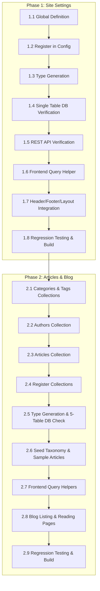

# CMS Implementation Roadmap

This directory contains the step-by-step development plans for implementing CMS modules into the Sekolah Pemikiran Islam (SPI) website.

---

## Execution Sequence

---

## Module Plans

1. **[Module 1: Site Settings](01-site-settings.md)**
   - **Type**: Global (`site-settings`)
   - **Database Impact**: Exactly +1 Table (`site_settings`)
   - **Scope**: Centralized branding, contact info, social links, SEO defaults, announcement banner, and footer metadata.

2. **[Module 2: Articles / Blog](02-articles-blog.md)**
   - **Type**: Collections (`Categories`, `Tags`, `Authors`, `Articles`)
   - **Database Impact**: Exactly +5 Tables (`articles`, `articles_rels`, `categories`, `tags`, `authors`)
   - **Scope**: Full editorial publishing, Lexical rich text, single primary category, multi-topic tags, decoupled author credentials, archive grid, and article reading views.
