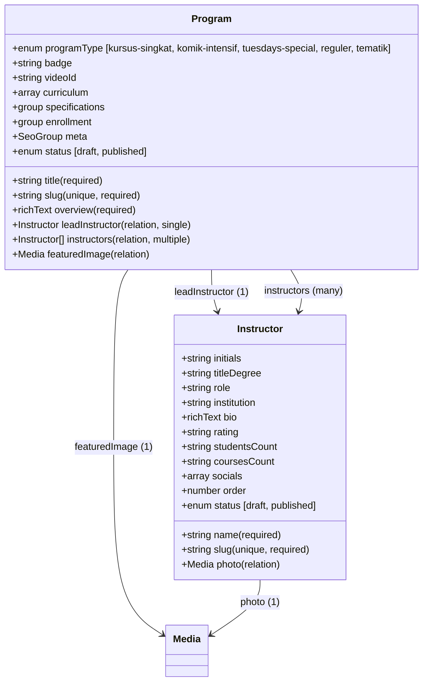

# CMS Module: Academic Programs & Instructors (Program & Pengajar)

Specification document for the **Academic Programs & Instructors** module on the Sekolah Pemikiran Islam (SPI) CMS.

---

## 1. Goals

1. **Centralized Academic Management**: Provide SPI academic coordinators and administrators with an intuitive interface to manage programs, curricula, syllabi, and faculty directories.
2. **Dynamic Program Routing**: Support dedicated dynamic routes for flagship programs (`/kursus-singkat`, `/komik-intensif`, `/tuesdays-special`) and modular topical courses with SEO metadata and Open Graph social cards.
3. **Curricular Transparency**: Allow administrators to publish structured course outlines (semesters, modules, session topics, and learning objectives) without developer intervention.
4. **Scholarly Faculty Authority**: Maintain a distinguished faculty directory (`/about-v1/pengajar`) highlighting academic credentials, institutional affiliations, areas of expertise, biographies, and courses taught.
5. **Flexible Enrollment Call-to-Action**: Configure batch-specific registration links, admission statuses (*Open*, *Upcoming*, *Closed*), and external intake channels per program.

---

## 2. User Stories

### US-1: Faculty Directory Management
- **As an** SPI Academic Administrator,
- **I want to** create and update instructor profiles with academic degrees, institutional affiliations, bio, photo, and social links,
- **So that** the public can review the credentials of scholars teaching at SPI.

### US-2: Program Curriculum Publishing
- **As an** Academic Coordinator,
- **I want to** structure programs into semesters/modules and specify individual lesson topics,
- **So that** prospective students can review the exact learning progression before enrolling.

### US-3: Lead Instructor Assignment
- **As an** Administrator,
- **I want to** link a lead instructor and secondary faculty members to each academic program,
- **So that** program pages display verified instructor details, bios, and ratings.

### US-4: Enrollment Status & Link Updates
- **As an** Admissions Officer,
- **I want to** toggle program intake statuses (*Buka Pendaftaran*, *Segera Hadir*, *Pendaftaran Ditutup*) and update Google Forms / WhatsApp / portal registration URLs,
- **So that** visitors always see up-to-date enrollment instructions.

### US-5: Public Program Catalog
- **As a** Prospective Student,
- **I want to** explore programs in grid and list views (`/courses-v1`) filtered by program format (*Reguler*, *Daring*, *Tematik*), and drill down into comprehensive course details,
- **So that** I can find the course that best fits my schedule and learning goals.

---

## 3. Schema Architecture & Entity Relationships

The module consists of **2 primary collections**:

---

## 4. Collection Specifications

### 4.1. `Instructors` (`slug: "instructors"`)
Dedicated faculty collection representing teachers, researchers, and Islamic scholars.

| Field Name | Type | Required | Default Value | Description |
| :--- | :--- | :---: | :--- | :--- |
| `name` | `text` | **Yes** | — | Full name with honorifics (e.g. "Dr. Akmal Sjafril, S.T., M.Pd.I."). |
| `slug` | `text` | **Yes** | auto-slug | URL-safe identifier (e.g. `dr-akmal-sjafril`). Unique, indexed. |
| `initials` | `text` | No | auto | 2-letter initials for circular avatar badges (e.g. `AS`, `WS`). |
| `titleDegree` | `text` | No | — | Academic degrees or titles (e.g. "S.T., M.Pd.I., Ph.D."). |
| `role` | `text` | No | — | Organizational role (e.g. "Pendiri dan Kepala Pusat SPI", "Dosen Tamu"). |
| `institution` | `text` | No | — | Primary academic/dakwah affiliation (e.g. "Universitas Indonesia", "AILA Indonesia"). |
| `photo` | `upload` | No | — | Relation to `media`. Profile photograph. |
| `bio` | `richText` | No | — | Lexical rich text or detailed biography describing education, research, and publications. |
| `rating` | `text` | No | "4.9/5" | Display rating indicator for course sidebars. |
| `studentsCount` | `text` | No | — | E.g. "14 Angkatan" or "500+ Mahasiswa". |
| `coursesCount` | `text` | No | — | E.g. "9 Topik Kajian". |
| `socials` | `array` | No | — | Subfields: `platform` (`select`), `url` (`text`). |
| `order` | `number` | No | 100 | Display ordering priority on `/about-v1/pengajar`. |
| `status` | `select` | **Yes** | `"published"` | `draft` or `published`. |

### 4.2. `Programs` (`slug: "programs"`)
Educational courses, intensive online classes, and regular academic programs.

| Field Name | Type | Required | Default Value | Description |
| :--- | :--- | :---: | :--- | :--- |
| `title` | `text` | **Yes** | — | Program title (e.g. "Kursus Singkat Reguler SPI"). |
| `slug` | `text` | **Yes** | auto-slug | URL slug (`kursus-singkat`, `komik-intensif`, `tuesdays-special`). Unique, indexed. |
| `programType` | `select` | **Yes** | `"kursus-singkat"` | `kursus-singkat`, `komik-intensif`, `tuesdays-special`, `reguler`, `tematik`. |
| `tagline` | `text` | No | — | Brief hook / badge (e.g. "Dua semester fondasi pemikiran Islam"). |
| `overview` | `richText` | **Yes** | — | Comprehensive program description and objectives. |
| `leadInstructor` | `relationship` | No | — | Relation to `instructors` (`hasMany: false`). Primary instructor shown in sidebar. |
| `instructors` | `relationship` | No | — | Relation to `instructors` (`hasMany: true`). Additional faculty members. |
| `featuredImage` | `upload` | No | — | Relation to `media`. Main promo/sidebar banner image. |
| `videoId` | `text` | No | `"lrhxrMZozA0"` | YouTube video ID for intro popup modal. |
| `curriculum` | `array` | No | — | Semesters or modules breakdown. |
| ↳ `title` | `text` | **Yes** | — | Module title (e.g. "Semester 1 — Fondasi Pemikiran Islam"). |
| ↳ `description` | `textarea` | No | — | Learning outcomes for this module. |
| ↳ `lessons` | `array` | No | — | Nested list of sessions/lessons. |
| &nbsp;&nbsp;↳ `title` | `text` | **Yes** | — | Topic title (e.g. "Ru'yat al-Islam li al-Wujud"). |
| `specifications` | `group` | No | — | Program parameters displayed in the "Program ini mencakup" widget: |
| ↳ `sessions` | `text` | No | "22 Sesi" | Number/format of sessions. |
| ↳ `duration` | `text` | No | "2 Semester" | Duration string. |
| ↳ `level` | `text` | No | "Semua jenjang" | Target level. |
| ↳ `language` | `text` | No | "Indonesia" | Instructional language. |
| ↳ `certificate` | `checkbox` | No | `false` | Whether certificate is issued. |
| ↳ `price` | `text` | No | "—" | Tuition/pricing label. |
| `enrollment` | `group` | No | — | Call to action and intake configuration: |
| ↳ `status` | `select` | No | `"open"` | `open` ("Daftar Sekarang"), `upcoming` ("Segera Hadir"), `closed` ("Ditutup"). |
| ↳ `ctaLabel` | `text` | No | "Daftar Sekarang" | Button label. |
| ↳ `ctaUrl` | `text` | No | "#" | External registration URL (Google Forms, WhatsApp, etc.). |
| `meta` | `group` | No | — | SEO override fields: `title`, `description`, `image`. |
| `status` | `select` | **Yes** | `"published"` | `draft` or `published`. |

---

## 5. Database Schema & SQLite Table Footprint

Payload CMS with SQLite adapter will automatically generate the corresponding tables:

1. **`instructors`**: Core instructor records.
2. **`instructors_socials`**: Array sub-table for social media handles.
3. **`programs`**: Core program records, including scalar foreign keys:
   - `lead_instructor_id` → `instructors(id)`
   - `featured_image_id` → `media(id)`
4. **`programs_rels`**: Relationship join table for many-to-many associations (e.g. secondary `instructors`).
5. **`programs_curriculum`**: Array sub-table for program curriculum modules/semesters.
6. **`programs_curriculum_lessons`**: Nested array sub-table for lessons within each module.

> [!NOTE]
> All array tables are strictly managed by Payload CMS and Drizzle ORM. Scalar relations (`leadInstructor`, `featuredImage`) do not create unnecessary join tables.

---

## 6. Frontend Mapping & Integration

| Website Route | Existing Component | CMS Data Source | Fallback Mechanism |
| :--- | :--- | :--- | :--- |
| `/about-v1/pengajar` | [`PengajarSection.tsx`](file:///var/www/spi-web/components/pages/inner/about-v1/PengajarSection.tsx) | `getInstructors()` | `aboutV1PengajarContent` |
| `/about-v1/pengajar-alt` | [`PengajarTeamSection.tsx`](file:///var/www/spi-web/components/pages/inner/about-v1/PengajarTeamSection.tsx) | `getInstructors()` | `aboutV1PengajarContent` |
| `/kursus-singkat` | [`kursus-singkat/page.tsx`](file:///var/www/spi-web/app/(site)/kursus-singkat/page.tsx) | `getProgramBySlug("kursus-singkat")` | `kursusSingkatContent` |
| `/komik-intensif` | [`komik-intensif/page.tsx`](file:///var/www/spi-web/app/(site)/komik-intensif/page.tsx) | `getProgramBySlug("komik-intensif")` | `komikIntensifContent` |
| `/tuesdays-special` | [`tuesdays-special/page.tsx`](file:///var/www/spi-web/app/(site)/tuesdays-special/page.tsx) | `getProgramBySlug("tuesdays-special")` | `tuesdaysSpecialContent` |
| `/courses-v1` | [`CoursesClassicSection.tsx`](file:///var/www/spi-web/components/pages/inner/courses-v1/CoursesClassicSection.tsx) | `getPrograms()` | `coursesV1Content` |

---

## 7. Migration & Seeding Strategy

To ensure zero downtime and 100% regression safety:
1. Seed the **13 core SPI faculty members** from [`content/inner/about-v1.ts`](file:///var/www/spi-web/content/inner/about-v1.ts) into `instructors`.
2. Seed the **3 flagship programs** (`kursus-singkat`, `komik-intensif`, `tuesdays-special`) from existing content files.
3. Link `leadInstructor` for Kursus Singkat, KOMIK, and Tuesday's Special to `Dr. Akmal Sjafril, S.T., M.Pd.I.`.
4. Ensure all frontend components gracefully fall back to static constants if the database is unpopulated or unreachable.
