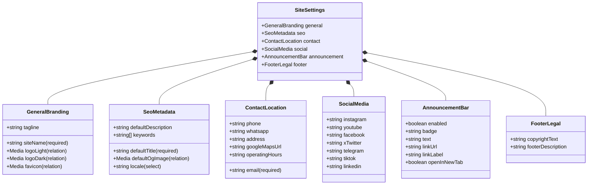

# CMS Module: Site Settings

Specification document for the **Site Settings** module on the Sekolah Pemikiran Islam (SPI) CMS.

---

## 1. Goals

1. **Centralize Global Configuration**: Migrate all site-wide configuration previously hardcoded in `lib/siteConfig.ts` into a dedicated Payload CMS Global (`site-settings`).
2. **Empower Non-Technical Administrators**: Allow SPI administrators to update contact channels, official social media links, copyright text, and SEO metadata directly from the Admin Panel without modifying code or triggering a new deployment.
3. **Dynamic Announcement Banner**: Provide a configurable notification banner at the top of the website that can be toggled on/off on demand (e.g., when registration opens for a new class).
4. **Resilience & Graceful Fallback**: Guarantee that public frontend routes continue to render reliably by falling back to static defaults (`lib/siteConfig.ts`) if the CMS database is empty, initializing, or unreachable.

---

## 2. User Stories

### US-1: Official Contact Information Management
- **As a** Site Administrator,
- **I want to** update the official contact email, phone number, WhatsApp link, and physical office address in the CMS,
- **So that** prospective students and visitors always find accurate, up-to-date contact details in the header, footer, and contact page.

### US-2: Social Media Channel Updates
- **As a** Media & Communications Team Member,
- **I want to** manage the URLs of our official social media accounts (Instagram, YouTube, Facebook, Twitter/X, TikTok, Telegram, LinkedIn),
- **So that** visitors clicking social media icons across the site are seamlessly directed to the active, official profiles.

### US-3: Default SEO & Metadata Optimization
- **As a** Content / SEO Specialist,
- **I want to** define the default site title, meta description, favicon, and default Open Graph (OG) sharing image,
- **So that** search engine snippets and social previews on WhatsApp, Twitter, and Facebook look professional and consistent.

### US-4: Site-Wide Announcement Banner
- **As an** Admissions Administrator,
- **I want to** toggle a high-visibility announcement banner at the top of the site with custom text and a Call-to-Action (CTA) link,
- **So that** visitors immediately notice important announcements (such as registration opening for *Kursus Singkat*, *KOMIK Intensif*, or *Tuesday's Special*).

### US-5: Access Control & Security
- **As the** System,
- **I want** the site settings data to be publicly readable by the Next.js frontend, but restricted to authenticated administrators for updates,
- **So that** site configurations are secure against unauthorized modifications.

---

## 3. Schema Data (Payload Global: `SiteSettings`)

In Payload CMS, this module is modeled as a **Global** (`slug: "site-settings"`). In the Admin Panel, fields are organized into structured tabs for optimal usability.

### Data Model Diagram



### Database Architecture (Single Table Strategy)

To keep the database footprint minimal, performant, and simple to migrate between SQLite and PostgreSQL, the **Site Settings** module uses a **Single Table Strategy**:

- **Target Table**: Exactly **1 table** is created: `site_settings`.
- **Direct Column Mapping**: All primitive attributes (`text`, `textarea`, `email`, `checkbox`, `select`) are mapped to single columns (`VARCHAR`, `TEXT`, `BOOLEAN`).
- **Tab Layouts**: The 6 tabs are purely visual UI organization in the Admin dashboard; they do **not** split fields into multiple tables.
- **Media Relationships**: Single upload relationships (`logoLight`, `logoDark`, `favicon`, `defaultOgImage`) are stored as **Foreign Key ID columns** (`logo_light_id`, `logo_dark_id`, etc.) directly referencing `media.id`. No junction or join tables are created.
- **Keywords as Plain Text**: Search keywords are stored as a comma-separated text string rather than an array field, preventing Drizzle from creating a secondary table.
- **No Revision History Table**: Versioning is disabled (`versions: false`), keeping the table count strictly at 1.

```
Database Schema Impact:
Existing Tables (9): users, users_sessions, media, payload_kv, payload_locked_documents, 
                     payload_locked_documents_rels, payload_preferences, payload_preferences_rels, 
                     payload_migrations
New Table Added (+1): site_settings
Total Tables: 10
```

### Tab & Field Specifications

#### Tab 1: General & Branding (`general`)
| Field Name | Type | Required | Default Value | Description |
| :--- | :--- | :---: | :--- | :--- |
| `siteName` | `text` | Yes | `Sekolah Pemikiran Islam` | The official name of the organization/site. |
| `tagline` | `text` | No | `Menghidupkan Tradisi Ilmu untuk Kejayaan Peradaban Islam` | Official organizational motto or tagline. |
| `logoLight` | `upload` (`media`) | No | - | Light logo variant (for dark backgrounds / transparent headers). |
| `logoDark` | `upload` (`media`) | No | - | Dark logo variant (for light backgrounds). |
| `favicon` | `upload` (`media`) | No | - | Browser tab icon (`.ico`, `.webp`, `.png`). |

#### Tab 2: SEO & Metadata (`seo`)
| Field Name | Type | Required | Default Value | Description |
| :--- | :--- | :---: | :--- | :--- |
| `defaultTitle` | `text` | Yes | `Sekolah Pemikiran Islam — Menghidupkan Tradisi Ilmu untuk Kejayaan Peradaban Islam` | Fallback browser title when a specific page title is not defined. |
| `defaultDescription` | `textarea` | No | Brief summary of SPI's history since 2014 across six cities | Default meta description for search engines. |
| `keywords` | `text` | No | `sekolah pemikiran islam, spi, kajian islam` | Comma-separated SEO keywords (stored as text to avoid auxiliary tables). |
| `defaultOgImage` | `upload` (`media`) | No | - | Default Open Graph preview image when sharing site links on social media. |
| `locale` | `select` | Yes | `id_ID` | Options: `id_ID` (Indonesian), `en_US` (English). |

#### Tab 3: Contact & Location (`contact`)
| Field Name | Type | Required | Default Value | Description |
| :--- | :--- | :---: | :--- | :--- |
| `email` | `email` | Yes | `info@pemikiranislam.id` | Official contact email address. |
| `phone` | `text` | No | - | Official office telephone number. |
| `whatsapp` | `text` | No | - | Official WhatsApp number (e.g. `6281234567890`). |
| `address` | `textarea` | No | - | Physical office or headquarters address. |
| `googleMapsUrl` | `text` | No | - | Link to Google Maps location. |
| `operatingHours` | `text` | No | `Senin - Jumat, 09:00 - 17:00 WIB` | Office hours for inquiries and visits. |

#### Tab 4: Social Media (`social`)
| Field Name | Type | Required | Description |
| :--- | :--- | :---: | :--- |
| `instagram` | `text` | No | URL to official Instagram profile. |
| `youtube` | `text` | No | URL to official YouTube channel. |
| `facebook` | `text` | No | URL to official Facebook page. |
| `xTwitter` | `text` | No | URL to official Twitter/X account. |
| `telegram` | `text` | No | URL to official Telegram channel or group. |
| `tiktok` | `text` | No | URL to official TikTok profile. |
| `linkedin` | `text` | No | URL to official LinkedIn page. |

#### Tab 5: Announcement Bar (`announcement`)
| Field Name | Type | Required | Default Value | Description |
| :--- | :--- | :---: | :--- | :--- |
| `enabled` | `checkbox` | Yes | `false` | Master toggle to enable or disable the top banner. |
| `badge` | `text` | No | `Pengumuman` | Small highlight badge (e.g., "Registration Open", "Announcement"). |
| `text` | `text` | No | - | Main announcement text message. |
| `linkUrl` | `text` | No | - | Destination link URL when clicking the banner or CTA button. |
| `linkLabel` | `text` | No | `Selengkapnya` | Label text for the action button. |
| `openInNewTab`| `checkbox` | Yes | `false` | Whether to open the link in a new browser tab. |

#### Tab 6: Footer & Legal (`footer`)
| Field Name | Type | Required | Default Value | Description |
| :--- | :--- | :---: | :--- | :--- |
| `copyrightText` | `text` | No | `Sekolah Pemikiran Islam. All rights reserved.` | Copyright notice displayed at the bottom of the footer. |
| `footerDescription` | `textarea`| No | - | Short introductory text displayed under the logo in the footer. |

---

## 4. Access Control

- **Read (`read`)**: Public (`() => true`). The Next.js frontend can query settings without authentication tokens.
- **Update (`update`)**: Restricted to authenticated users (`({ req: { user } }) => Boolean(user)`).

---

## 5. Frontend Integration Pattern (Next.js)

1. A query helper `lib/getSiteSettings.ts` will fetch the global via Payload's Local API:
   ```typescript
   import { getPayload } from "payload";
   import config from "@payload-config";
   import { siteConfig } from "@/lib/siteConfig";

   export async function getSiteSettings() {
     try {
       const payload = await getPayload({ config });
       const settings = await payload.findGlobal({
         slug: "site-settings",
         depth: 1, // Populates media relations (logos, favicon, ogImage)
       });
       return settings || siteConfig;
     } catch (err) {
       console.warn("Falling back to static siteConfig:", err);
       return siteConfig;
     }
   }
   ```
2. Layout components (`Header.tsx`, `Footer1.tsx`, and `app/layout.tsx`) consume this helper for dynamic rendering with guaranteed zero downtime during initialization.

---

## 6. Definition of Done (DoD)

- [x] **Documentation**: Goals, user stories, data schema, access rules, and DoD documented in `docs/site-settings.md`.
- [ ] **Payload Global Implementation**: File `payload/globals/SiteSettings.ts` implemented with all tabs, fields, and validations.
- [ ] **Global Registration**: `SiteSettings` registered under `globals` in `payload.config.ts`.
- [ ] **Media Integration**: Upload fields (`logoLight`, `logoDark`, `favicon`, `defaultOgImage`) successfully link to the `media` collection.
- [ ] **Admin Panel UI**: The *Site Settings* entry appears in the Payload admin sidebar, correctly displays tabbed layout, and saves data reliably.
- [ ] **Single Table Verification**: Verified that exactly 1 table (`site_settings`) is created in the database with direct foreign keys to `media`, and no unnecessary child tables.
- [ ] **REST API Verification**: Endpoint `GET /api/globals/site-settings` returns `200 OK` with the expected JSON payload.
- [ ] **Frontend Helper**: `lib/getSiteSettings.ts` created with fallback to `lib/siteConfig.ts`.
- [ ] **Build & Typecheck**: `npx tsc --noEmit` passes with 0 errors and `npm run build` succeeds cleanly.
